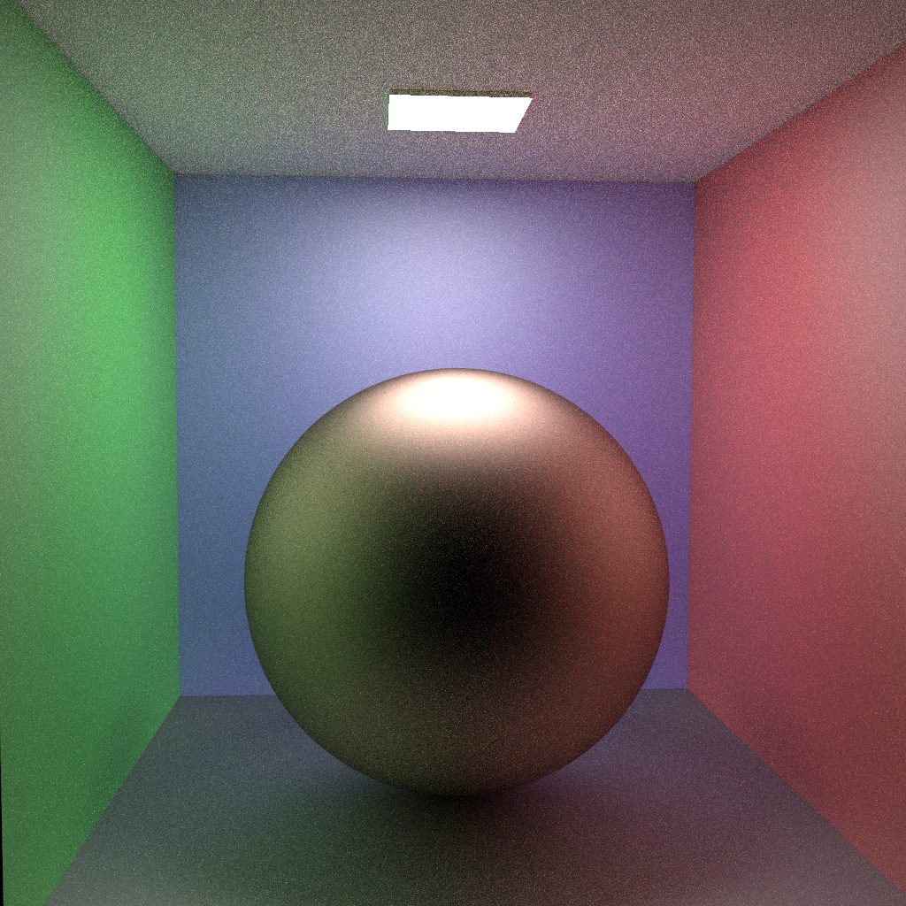

# SmallMVPT

SmallMVPT is a hack of [SmallVCM](http://www.smallvcm.com/) that implements the multi-view path tracing 
algorithm ([Project Page](https://bfraboni.github.io/data/mvpt19/index.html)) described in the paper

	"Adaptive Multi-View Path Tracing"
	Basile Fraboni, Jean-Claude Iehl, Vincent Nivoliers, Guillaume Bouchard
	Eurographics Symposium on Rendering 2019

as well as a the classic independent path tracing algorithm. 
The code compiles to a command line program that can render images of a number 
of predefined scenes using the provided algorithms.

Disclaimer:
  * Unless you really care, you can safely ignore all licenses in the source
    code.
  * This code is meant for educational purposes, and is not the code that was
    used to render the images in the aforementioned paper. The provided scenes
	are too simple to provide a complete understanding of the performance of
	every implemented rendering algorithm and the differences between them.
  * We are aware that the description below is not as detailed as it can be, and
    apologize for any errors and confusion.
  * If you have any questions and/or input w.r.t. improving and adding
    explanations, feel free to contact Basile Fraboni <basile.fraboni@insa-lyon.fr> 
    the primary author of the above paper, and we will figure out whatever you
	might need.

## Compilation

Synopsis: Compile smallmvpt.cxx with OpenMP.

The whole program consists of one C++ source file and a multiple header files.
It was developed on Linux and the provided Makefile works for g++ 8.3, however 
we did some limited testing on Windows. There are no dependencies.

## Operation

The features and settings of the program can be explored by running
`smallmvpt --help`, which outputs the following information:

```
Usage: smallmvpt [ -s <scene_id> [exp] | -t <time> | -i <iteration> | -o <output_name> | -r ]

    -s  Selects the scene (default 0):
        0       glossy small spheres + sun (directional)
        1       glossy large mirror sphere + ceiling (area)
        2       glossy small spheres + point
        3       glossy small spheres + background (env. lighting)
        4 exp   full glossy scene with constant exponent + ceiling (area)
                which have to be specified after the scene number (e.g. -s 4 2)

    -r  Active MVPT path reusing
    -t  Number of seconds to run the algorithm
    -i  Number of iterations to run the algorithm (default 1)
    -o  User specified output name, with extension .bmp or .hdr (default .bmp)

    'glossy' applies to the floor of the Cornell box. Except for scene 4.
    'small spheres' variants have one mirror and one glass spheres in the box.	
	
    The program can run in two modes:
    1)  If -r is not set, a sequence of 9 images of the specified scene will be
        rendered using independent path tracing, obeying the number of 
        iterations - specified time.
    2)  Setting the -r option renders the sequence using the MVPT algorithm.

    All default settings are set in the ParseCommandline function in config.hxx.
    Some settings have no command line switch, but can be changed in the code:

    mNumThreads     Number of rendering threads (default 0, means 1 thread/core)
    mBaseSeed       Seed for random number generators (default 1234)
    mMinPathLength  Minimal path length (i.e. number of segments) (default 0)
    mMaxPathLength  Maximal path length (i.e. number of segments) (default 10)
    mResolution     Image resolution (default 512x512)
```

## MVPT renderer
    
The MVPT algorithm is implemented in multiview.hxx. Short description of the MVPT pipeline:
    
1.  primary ray sampling and casting
2.  if a light is hit: 
    * accumulate directly hit light
    * we do not reuse directly hit light since it can lead to artefacts at light edges and does not reduce variance
3.  if the BSDF is a dirac: 
    * fall back to standard path tracing since no reuse can occur on perfectly specular materials
4.  else select a subset of cameras for path reusing
    * check visibility, orientation, raster bounds, similarity (material distance + Jacobian)
5.  MIS weights computation
6.  next event estimation
    * mixture pdf evaluation for direct MIS weights
    * accumulate direct contributions
7.  continue random walk
    * mixture importance sampling the direction
    * continue with standard path tracing
    * accumulate indirect contributions

## FEATURES and LIMITATIONS

The implementation is still compact and readable. Since no features were added 
except a full glossy scene, please refer to the original SmallVCM description 
for further details [SmallVCM](http://www.smallvcm.com/).

## EXAMPLE

150s renderings of the glossy scene with exponent set to 4:

|PT|MVPT|
|:-:|:-:|
||| 